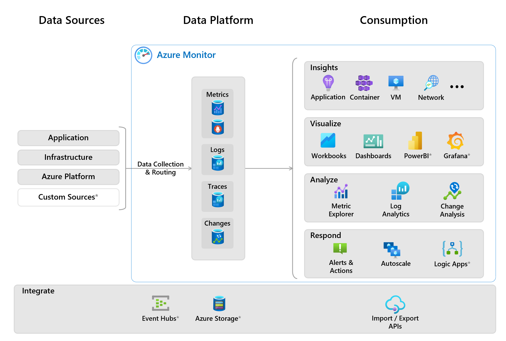

# HoL1 Monitoring

Landing Zone에서 관리 디자인 Area

[https://learn.microsoft.com/ko-kr/azure/cloud-adoption-framework/ready/landing-zone/design-area/management-platform](https://learn.microsoft.com/ko-kr/azure/cloud-adoption-framework/ready/landing-zone/design-area/management-platform)

## 시나리오

Microsoft Azure에는 다양한 모니터링 및 보안 관제 서비스가 존재합니다. 각각의 서비스에 대해 알아보고 Landing Zone 구성에 맞는 모니터링과 보안 관제를 구성합니다.  

## 아키텍쳐 구성 요소

HoL1에 진행하였던 Hub-Spoke 에 있는 리소스들에 대해 모니터링을 진행해보며 시나리오에 맞게 모니터링 및 보안 관제를 구성합니다. 

**Data Source** → 실제로 모니터링하려는 리소스들로, Azure에 있는 리소스들뿐만 아니라 AWS, GCP 리소스 혹은 온프레미스에 있는 리소스도 가능합니다. 

**Data Platform** → 데이터들은 다양한 방식을 사용해 수집되며

- 코드에서 수집 : Application Insight SDK
- Agent : Agent를 설치하여 구성
- Internal : 사용자 구성 없이 Azure Monitor에 자동으로 전송

 각각의 데이터들은(Metric, Logs, Tracs, Changes) 각각에 맞는 저장소에 저장됩니다.

**Data Consumption** → 해당 데이터를 이용해 인사이트를 얻으며 필요에 따라 시각화나 분석화를 진행합니다. 또한 응답에 따라 알람을 받거나 특정 논리 구성에 따라 진행 될 수 있게 합니다. 

가장 기본적인 모니터링은 Azure Portal에서 확인할 수 있으며 

크게 4가지의 방식으로 모니터링을 진행할 수 있습니다. 

**1) Insight**

- Application Insights : Application Insights의 경우 Azure Monitor를 활용하여 Application 에 대한 자세한 인사이트를 제공합니다.
    - 모니터링 : 웹 애플리케이션의 가용성, 성능 및 사용량, 오류 진단
- Container Insight : Container Insight의 경우 Kubernetes 클러스터에 배포되는 워크로드에 대한 성능 가시성을 제공합니다.
    - 모니터링 : 컨트롤러, 노드 및 컨테이너 로그 및 매트릭 수집
    - Linux용 Log Analytics 에이전트의 컨테이너화된 버전을 통해 자동으로 수집됨
- VM Insight
    - Windows 및 Linux VM성능과 상태를 분석
- Network Insight
    - 다른 구성 없이 모든 네트워크 리소스에 대한 토폴로지를 시각으로 표현
    - 연결 모니터 (네트워크 리소스 연결에 대한 상태 모니터링) NSG 및 Traffic Analytics에 대한 네트워크 모니터링 기능에 액세스 가능

**2) 분석 (Analysis)**

- 사용자의 필요에 따라 데이터들을 Query 할 수 있습니다.
    
    ex) CPU 사용률이 자주 70%가 넘었던 VM들, 사용자의 로그인 횟수
    

3**) 시각화 (Visualize)**

- 차트 및 표 시각화는 모니터링 데이터를 요약해서 보여주는 효과적인 도구 입니다.
- Workbooks과 Dashboard의 경우 Azure에서 제공되는 서비스이며 PowerBI는 마이크로소프트 제품이며 Grafana는 그라파나랩에서 개발된 제품입니다. 하지만 두 제품 모두 Azure Monitor와 함꼐 사용할 수 있는 강력한 툴입니다.

**4) 대응 (Respond)**

모니터링 결과에 따라 사전에 대응합니다. 예를 들어 관리자에게 모니터링상 이슈가 발생되었을때 SMS나 Email을 전송하고 아니면 자동적으로 리소스들을 구성합니다. (Auto-Scale)

## 도전 과제

앞선 네가지 모니터링 부분에 대해 도전 과제를 진행하며 서비스에 대한 이해도를 높혀봅니다. 🙂  HoL1에 사용하였던 Hub-Spoke 리소스들을 기반으로 모니터링을 진행합니다. 

순서는 동일하게 1) Insight → 2)분석 → 3)시각화 → 4) 대응으로 진행합니다. 

**Landing Zone 고려 사항** 

- 경고 알림이 필요한 팀은 어디인가요?
- 여러 팀에게 알려야 하는 서비스 그룹이 있나요?
- 경고를 보내야 하는 기존 서비스 관리 도구가 있나요?
- 비즈니스에 중요한 것으로 간주되고 우선 순위가 높은 알림이 필요한 서비스는 무엇인가요?

**1) Insight**

- 각각의 Metric를 확인합니다. 또한 어떤 매트릭을 지원하는지도 함께 알아봅니다.
    
    참고 url : [https://learn.microsoft.com/ko-kr/azure/azure-monitor/essentials/metrics-supported](https://learn.microsoft.com/ko-kr/azure/azure-monitor/essentials/metrics-supported) 
    
    
    
    [리소스 → 매트릭]
    
- 리소스 그룹에 잠금을 사용하여 리소스가 실수로 삭제하지 않도록 합니다.

[리소스 그룹 → 잠금]

**2) 분석 (Analyze)**

- Log Analytics를 구성하여 Query를 작성해봅니다.

1) 리소스 그룹 생성

2) Log Analytics Workspace 추가 

- Log Analytics 작업 영역 생성

- Log Analytics 전체 화면

- 각각의 VM에 Log Analytics Agent 설치

[Log Analytics 시작 → 데이터 원본에 연결]

- 데이터 컬렉션 규칙 설정

- 데이터 수집 규칙 만들기

[리소스 추가] → [리소스 그룹 선택] → [대상 리소스 선택]

[데이터 원본 추가] → [데이터 원본]/ 성능 카운터 혹은 Windows 이벤트 로그] 

[대상 유형] Azure Monitor Logs → 구독 선택 → Log Analytics Workspace 선택(이 문서의 경우 ws-la-monitoring]

- Log Analytics Workspace 진단 설정

해당 설정은 리소스 플랫폼 로그 및 매트릭을 선택한 대상으로 보내는 구성입니다. 

- Log Analytics 작업 영역 → 진단 설정

- 로그인에 실패한 사용자는? 특정 audit log 검색해보기

참고 URL : [https://learn.microsoft.com/en-us/azure/azure-monitor/logs/queries](https://learn.microsoft.com/en-us/azure/azure-monitor/logs/queries)

예) 가능한 Memory 검색

- 결과

**3) 시각화 (Visualize)**

- Workbook 혹은 대시 보드를 이용하여 필요한 매트릭으로 대시보드를 구성합니다.

매트릭 → 대시보드에 저장 → 대시보드에 고

- Azure Managed Grafana를 이용하여 대시보드를 구성해봅니다. (Optional)
    - 참고 URL : [https://learn.microsoft.com/ko-kr/azure/managed-grafana/quickstart-managed-grafana-portal](https://learn.microsoft.com/ko-kr/azure/managed-grafana/quickstart-managed-grafana-portal)

**4) 대응 (Respond)**

- 알람을 설정하여 특정 알람이 발생할 경우 Email과 Azure Mobile app에 알람이 오게 구성합니다.
    
    특정 알람은 분석에 썼던 Query를 이용해도 좋고 Azure가 기본적으로 제공하는 알람 구성이여도 됩니다. 
    
    - 참고 URL : [https://learn.microsoft.com/ko-kr/azure/azure-monitor/alerts/action-groups](https://learn.microsoft.com/ko-kr/azure/azure-monitor/alerts/action-groups)

경고 → 만들기 → 경고 규칙 만들기 

경고 규칙 만들기

작업 그룹 만들기 → 메일 

- 생성 후 테스트 진행

[모니터 → 작업 그룹]

작업 그룹 → 테스트 → 결과 확인하기

## 참고 URL

- Landing Zone : [https://learn.microsoft.com/ko-kr/azure/cloud-adoption-framework/ready/landing-zone/design-area/management-platform](https://learn.microsoft.com/ko-kr/azure/cloud-adoption-framework/ready/landing-zone/design-area/management-platform)
- Azure 모니터 : [https://learn.microsoft.com/ko-kr/azure/azure-monitor/overview](https://learn.microsoft.com/ko-kr/azure/azure-monitor/overview)
- Azure Log Analytics : [https://learn.microsoft.com/ko-kr/azure/azure-monitor/logs/log-analytics-tutorial](https://learn.microsoft.com/ko-kr/azure/azure-monitor/logs/log-analytics-tutorial)
- Azure 경고 : [https://learn.microsoft.com/ko-kr/azure/azure-monitor/alerts/alerts-overview](https://learn.microsoft.com/ko-kr/azure/azure-monitor/alerts/alerts-overview)