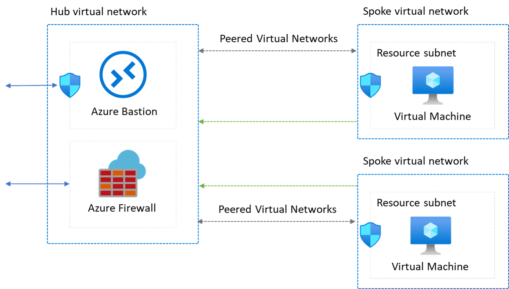

# Network Landing Zone

# 시나리오

이 아키텍처는 허브 가상 네트워크가 많은 스포크 가상 네트워크에 대한 연결의 중심 지점 역할을 하는 허브-스포크 네트워크 패턴을 구현합니다. 스포크 가상 네트워크는 허브와 연결되며 워크로드를 격리하는 데 사용할 수 있습니다.

허브 및 스포크 구성 사용의 이점은 다음과 같습니다.

- 비용 절감
- 구독 제한 극복
- 워크로드 격리

자세한 내용은 [허브 및 스포크 네트워크 토폴로지를 참조하세요](https://learn.microsoft.com/ko-kr/azure/cloud-adoption-framework/ready/azure-best-practices/hub-spoke-network-topology).

## 사용 사례

- 공유 서비스가 필요한 여러 환경이 있습니다. 예를 들어 워크로드에는 개발, 테스트 및 프로덕션 환경이 있을 수 있습니다. 공유 서비스에는 DNS ID, NTP(네트워크 시간 프로토콜) 또는 AD DS(Active Directory Domain Services)가 포함될 수 있습니다. 공유 서비스는 허브 가상 네트워크에 배치되고 각 환경은 격리를 유지하기 위해 다른 스포크에 배포됩니다.
- 서로 연결하지 않아도 되지만 공유 서비스에 액세스해야 합니다.
- 각 스포크에서 분리된 워크로드 관리를 사용하여 허브의 경계 네트워크(DMZ라고도 함) 방화벽과 같은 보안에 대한 중앙 제어가 필요합니다.
- 선택적 연결 또는 특정 환경 또는 워크로드의 스포크 간 격리와 같은 연결을 중앙에서 제어해야 합니다.

## 사전 준비 (15min)

### 리소스 그룹 생성

- 리소스 그룹 : hub-spoke

### 가상 네트워크 생성

**HubVNet**

- 가상 네트워크 이름 : HubVNet
- IP 주소 : 10.0.0.0/16
- 서브넷 : default (10.0.0.0/24)

**SpokeVNet1**

- 가상 네트워크 이름 : SpokeVNet1
- IP 주소 : 10.1.0.0/16
- 서브넷 : ResourceSubnet (10.1.0.0/24)

**SpokeVNet2**

- 가상 네트워크 이름 : SpokeVNet2
- IP 주소 : 10.2.0.0/16
- 서브넷 : ResourceSubnet (10.2.0.0/24)

### 가상 머신 생성

**VM1**

- 가상 머신 이름 : VM1
- 가상 네트워크 : SpokeVNet1
- 서브넷 : ResourceSubnet
- 공용 IP : 없음

**VM2**

- 가상 머신 이름 : VM2
- 가상 네트워크 : SpokeVNet2
- 서브넷 : ResourceSubnet
- 공용 IP : 없음

# 도전 과제 (90min)

## 관리 권장 사항

### **Azure Bastion 호스트 구성하기**

Azure Bastion은 브라우저를 사용하여 Azure Portal VM(가상 머신)으로의 보안 연결을 제공합니다. Azure 가상 네트워크 내에 배포된 Azure Bastion 호스트는 해당 가상 네트워크 또는 연결된 가상 네트워크의 VM에 액세스할 수 있습니다.

## 보안

### 네트워크 보안 그룹 구성하기

Azure 네트워크 보안 그룹을 사용하여 Azure 가상 네트워크의 Azure 리소스 간의 네트워크 트래픽을 필터링할 수 있습니다. 네트워크 보안 그룹에는 여러 종류의 Azure 리소스에서 오는 인바운드 트래픽 또는 이러한 리소스로 나가는 아웃바운드 네트워크 트래픽을 허용하거나 거부하는 [보안 규칙](https://learn.microsoft.com/ko-kr/azure/virtual-network/network-security-groups-overview#security-rules)
이 포함됩니다. 규칙마다 원본 및 대상, 포트, 프로토콜을 지정할 수 있습니다.

## 비용 최적화

### HubVNet에 Azure Firewall 적용하기

이 아키텍처는 허브 네트워크에 Azure Firewall 인스턴스를 배포합니다. Azure Firewall 배포를 여러 워크로드에서 사용하는 공유 솔루션으로 사용하면 다른 NVA에 비해 클라우드 비용을 크게 절감할 수 있습니다.

- **Azure Firewall**
    
    Azure Firewall은 Azure에서 실행되는 클라우드 워크로드에 대해 최상의 위협 보호를 제공하는 클라우드 네이티브 및 지능형 네트워크 방화벽 보안 서비스입니다. 고가용성 및 무제한 클라우드 확장성이 기본 제공되는 서비스 형태의 완전한 상태 저장 방화벽입니다. 동서 및 남북 트래픽 검사를 모두 제공합니다.
    
- ****Azure Firewall Subnet****
    
    주소 범위가 적어도 `/26`인 *AzureFirewallSubnet*이라는 서브넷을 만듭니다. 규모 `/26` 에 관계없이 주소 범위는 권장 크기이며 향후 크기 제한 사항을 포함합니다. 이 서브넷은 NSG(네트워크 보안 그룹)를 지원하지 않습니다.
    
    Azure Firewall에는 이 서브넷이 필요합니다. 파트너 NVA(네트워크 가상 어플라이언스)를 사용하는 경우 네트워크 요구 사항을 따릅니다.
    

### 스포크 네트워크 연결하기

개인 IP 주소를 사용하여 피어링된 가상 네트워크 간 또는 연결된 그룹의 네트워크 간에 트래픽을 라우팅할 수 있습니다. 다음 비용 고려 사항이 적용됩니다.

- 수신 및 송신 트래픽은 피어링되거나 연결된 네트워크의 양쪽 끝에서 요금이 청구됩니다. 예를 들어 영역 1의 가상 네트워크에서 영역 2의 다른 가상 네트워크로의 데이터 전송은 영역 1에 대한 아웃바운드 전송 속도와 영역 2의 인바운드 전송 속도를 발생합니다.
- 영역이 다르면 전송 속도가 다릅니다.

가상 네트워크 피어링 또는 연결된 그룹은 가상 네트워크 간의 비 전이적 관계입니다. 서로 연결하기 위해 스포크 가상 네트워크가 필요한 경우 해당 스포크 간에 피어링 연결을 추가하거나 동일한 네트워크 그룹에 배치합니다.

- ****허브 게이트웨이를 통해 원격 네트워크에 스포크 연결****
    
    허브 게이트웨이를 통해 원격 네트워크와 통신하도록 스포크를 구성하려면 가상 네트워크 피어링 또는 연결된 네트워크 그룹을 사용할 수 있습니다.
    
    [https://learn.microsoft.com/ko-kr/azure/virtual-network/virtual-network-manage-peering?tabs=peering-portal#create-a-peering](https://learn.microsoft.com/ko-kr/azure/virtual-network/virtual-network-manage-peering?tabs=peering-portal#create-a-peering)
    

# 검증 (15m)

### Network Watcher를 통한 트래픽 흐름 검증하기