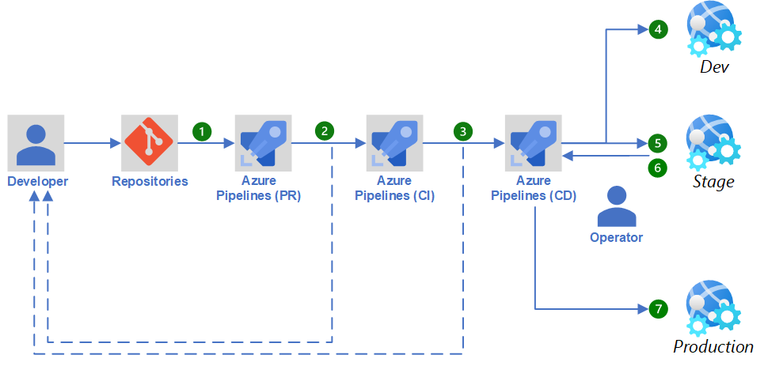
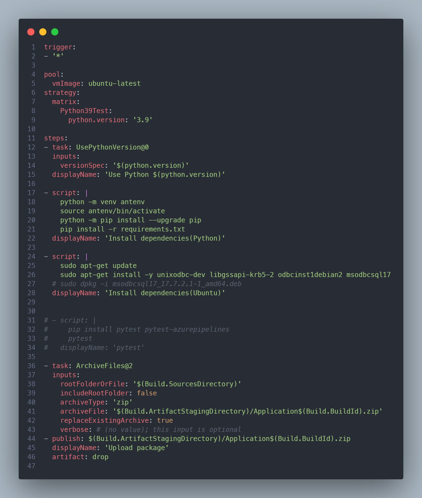

# DevOps

## 시나리오

## 시나리오 설명

Part1에서 생성한 웹앱의 운영 우수성을 위해 Azure DevOps를 이용한 CI(Continuous Integration)/CD(Continuous Delievery)를 구현해 봅시다. 웹 앱은 Deployment Slots라는 기능으로 실제 Production/Staging 또는 Testing/Development 등을 슬롯으로 만들어서 인스턴스를 여러 개 만들지 않고도 독립된 환경을 제공할 수 있습니다.

우리가 배포한 웹 앱에는 Title 오타가 있습니다. 해당 오류를 고치고 commit해 Dev, Stage에서 확인한 뒤에 Pull Request를 만들어서 Production에 배포합니다.

Dev는 배포 환경과 동일한 환경에서 자유롭게 개발 테스트를, Stage에서는 QA를 진행해 실제로 Production으로 배포되어도 문제가 없는지 확인합니다. 마지막으로 Operator의 승인을 수동으로 받은 뒤 실제 Production과 Stage를 swap하여 배포를 완료합니다.

이때 Operator는 본인 스스로라고 가정합니다.

## Cloud Adoption Framework와 DevOps

DevOps의 기초에 대해서 배우고, Cloud Adoption Framework의 운영 우수성을 위해 Landing zone DevOps가 필요한 이유에 대해 알아보겠습니다.

### 사전 준비

> 첫 번째 Lab에서 생성한 Web App의 `설정` 에 들어가서 `WEBSITE_RUN_FROM_PACKAGE="1"` 을 **삭제합니다**.
> 

## Azure DevOps Project 생성

1. [Azure DevOps Site](https://azure.microsoft.com/en-us/products/devops/?nav=min) 접속 후 ‘무료로 시작’ or ‘Start Free’ 선택
2. Azure Login
3. **New Organization 선택**
    - 중복되지 않는 이름
    - Southeast Asia 호스팅 설정
4. New Project  생성
    - 이름: `LG-CNS-<본인 이니셜>`
    
    
    

## Git Repo Import

> (자율 선택)
Github 사용이 익숙하지 않으신 분들을 위해 Azure DevOps Git Repo를 사용하는 시나리오를 선택했지만, Github이 더 익숙하다면 이 Repo Import는 skip하고 제공되는 깃헙 레포를 fork해주세요. Github을 선택한다면 Pipeline에서 본인이 fork한 repo를 연결하기 위해 별도의 Github 연결이 진행됩니다. 하지만 이러한 프로세스나 깃헙에 익숙하지 않다면 하기 단계를 따라하는 것을 권장합니다.
> 

- Repos > Files > Import >URL 입력: [GitHub - n-y-kim/TodoApp](https://github.com/n-y-kim/TodoApp/)

## Azure DevOps & CI/CD

우리는 CAF와 DevOps에 대한 설명을 들으면서 DevOps이 무엇인지, 왜 필요한 것인지 이해했습니다. 

DevOps 문화를 정착시키는 데 도움이 되는 Azure의 툴, Azure DevOps에 대해서 알아봅시다.

### Azure DevOps

## 도전과제

### Slot 생성하기

Web App에는 slot이라는 기능이 있습니다. slot은 DevOps에서 CI/CD를 위한 Dev/Test 환경으로도 쓰일 수 있고, 트래픽을 분산시켜 A/B Testing 용도로도 사용할 수 있습니다. 

Slot 기능은 App Service Plan standard 이상부터 사용 가능하기 때문에 첫 번째 핸즈온에서 생성한 App Service Plan에서 기존 B1 플랜에서 S1으로 업그레이드를 진행합니다.

Azure portal에서 위의 아키텍처와 같은 Slot( `Dev`, `Stage` )을 2개 생성합니다. Production slot은 이미 기존에 default로 지정되어 있는 프로덕션 환경을 말하기 때문에 생성할 필요가 없습니다.

### Azure Pipeline 구축(CI)

YAML(YAML Ain’t Markup Langauge)로 CI/CD 파이프라인을 구축하는 Azure Pipeline 기능은 YAML 파일 하나로 전체 파이프라인을 정의할 수 있습니다. 하지만 우리는 CI 부분만 `devops-pipeline.yaml` 파일을 이용해 진행합니다. 

통상적으로 Continuous Integration에서는 유닛 테스트가 있는 것이 원칙이지만, 저희는 빠른 데모를 위해 유닛 테스트 없이 Production 환경의 python3.9 라이브러리 종속성만 확인합니다. 실제로 완벽한 DevOps 문화를 위해서는 유닛 테스트를 작성하는 것이 매우 중요합니다. 

- 웹앱을 생성할 때 Ubuntu 환경에서 Python 3.9를 런타임 스택으로 선택했기 때문에, 동일하게 우리의 Job은 ubuntu-latest image에 3.9 버전을 사용합니다.
- 앱 서비스에서는 내부적으로 antenv 라는 가상환경 설정만 가상환경으로 인식하기 때문에 virtualenv을 ‘antenv’라는 이름으로 생성하고 필요한 라이브러리를 설치합니다.
- SQL DB와 연결을 위해 라이브러리를 설치합니다.
- 유닛테스트를 위해서는 pytest 와 같은 라이브러리를 쓸 수 있지만 진행하지 않기 때문에 주석 처리를 해두었습니다.
- 마지막으로 zip파일로 소스 코드를 묶어 패키지를 만듭니다.

### Azure Release 구축(CD)

Pipeline 중에서 Release 기능은 YAML이 아니라 GUI를 통해 CI/CD를 구축할 수 있는 레거시 기능입니다. GUI이기 때문에 구성하기가 더 쉽고 아래 이미지처럼 시각적으로 이해하기가 더 쉽다는 장점이 있기 때문에 우리는 CD를 Release로 진행합니다. 

이때 test용으로 만드는 branch에서 commit할 때는 Dev & Stage 환경에만 배포하는 Release 1개, 실제로 Pull Request로 main에 머지할 때 Dev & Stage & Production 환경까지 배포하는 Release 1개를 각각 만듭니다.

Trigger 설정에서 다음과 같이 특정 브랜치를 include/exclude 할 수 있으니 참고하시길 바랍니다.

**새로운 feature를 위한 main 외 브랜치에서 커밋 시 작동하는 Release**

**main merge시 작동하는 Release** 

### 안전한 Production을 위한 수동 승인 배포

실제 Production slot과 Stage slot을 swap해서 Stage에서 테스트 완료 된 코드를 프로덕션으로 최종 배포해봅니다. 이때 기존의 Dev → Stage 환경처럼 자동 배포를 하게 되면 아직 완벽하게 검증되지 않은 코드들이 프로덕션으로 올라갈 수 있습니다. 이를 방지하기 위해 수동으로 관리자/Operator의 승인을 받은 후에 우리가 완벽히 테스트한 Stage와 swap합니다.

이런 방식은 실제로 프로덕션에 문제가 생겼을 때 쉽게 Roll back 할 수 있다는 장점이 있습니다.

## 테스트

1. 새로운 Branch를 만듭니다. 
2. 새로운 Branch 내에서 `static/index.html` 의 오탈자(’**Toodo** App for LG CNS’)를 수정하고, 이를 commit 합니다.
3. Commit이 CI Pipeline & CD Release을 trigger하여 Dev & Stage 환경에 오탈자 수정이 반영되었는지 확인합니다.
    
    
    
    
    
    
    
4. 또한 Dev & Stage 환경에서도 기존 Prod와 동일하게 SQL DB 연결을 해준 뒤 연결이 잘 되어있는지 확인합니다.
    
    
    
5. main branch로 Pull Request를 생성합니다. 이때 본인을 Reviewer로 할당합니다. 
    
    
    
6. Conflict이 발생하지 않는 걸 확인하고 머지해줍니다.
7. Main에 merge를 한 뒤에 동일하게 CI 과정이 일어나고, Prod를 위한 CD Release가 동작하는지 확인합니다.
    
    

(참고) Build가 성공적으로 끝나면 메일 알림이 오고, 수동으로 Prod에 배포할 때도 승인 요청 이메일이 전송됩니다.

## 참고 URL

- [Landing Zone & DevOps](https://learn.microsoft.com/ko-kr/azure/cloud-adoption-framework/ready/considerations/devops-principles-and-practices?source=recommendations)
- [Microsoft의 DevOps](https://learn.microsoft.com/ko-kr/devops/develop/how-microsoft-develops-devops?view=azure-devops)
- [Azure DevOps](https://learn.microsoft.com/ko-kr/azure/devops/user-guide/what-is-azure-devops?toc=%2Fazure%2Fdevops%2Fget-started%2Ftoc.json&view=azure-devops)
- [Azure DevOps Pipeline](https://learn.microsoft.com/ko-kr/azure/devops/pipelines/get-started/what-is-azure-pipelines?view=azure-devops)