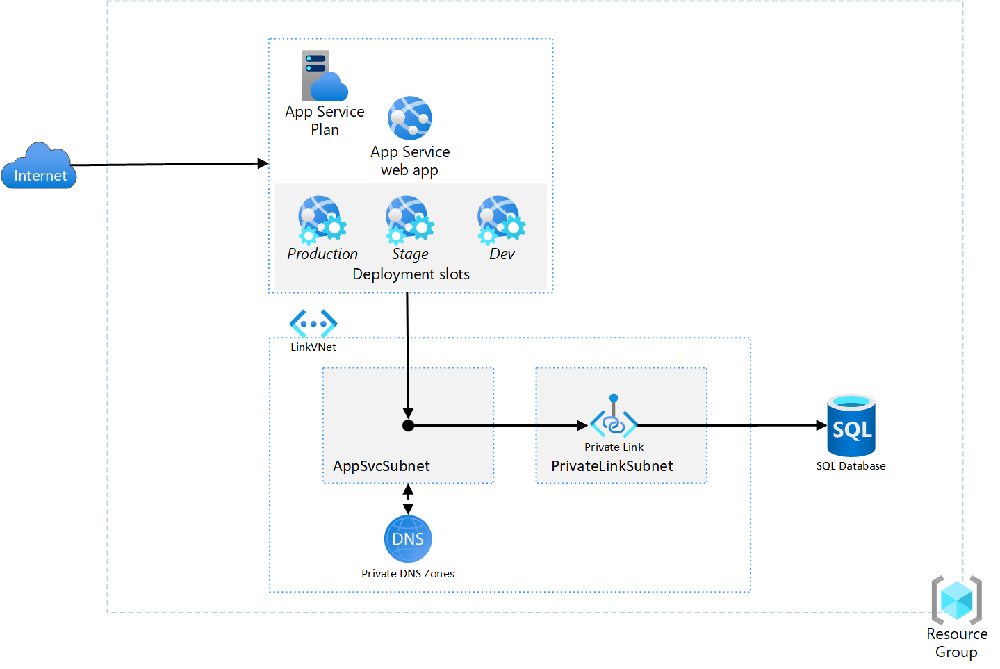

# Web App

## 시나리오



## 시나리오 설명

Azure App Service는 별도의 백엔드 서버 구축 없이 손쉽게 클라우드에 웹을 배포할 수 있습니다.  우리는 간단한 Todo App을 빠르게 배포하고 안전한 방법으로 SQL 데이터베이스와 연결합니다.

App Service와 데이터베이스의 안전한 연결 및 보안을 위해 Private Endpoint를 만들어서 해당 엔드포인트로 엑세스할 수 있도록 합니다.

## 웹 앱 리소스 생성

App Service는 App Service Plan(가격 책정 플랜)에 따라 multi-tenant 형태 또는 single-tenant 형태로 사용할 수 있습니다. 완전 독립된 VNet과 리소스를 위해서는 Premium App Service Plan과 별도의 App Service Environment가 필요합니다.

- 리소스 그룹: Day1에서 생성한 리소스 그룹 선택
- 이름: `<본인 이니셜>`-`<오늘 날짜>`
- 게시: `Code`
- Runtime stack: `Python 3.9`
- 운영체제: `Linux`
- 지역: `Korea Central`
    
    
    
- 가격 책정 플랜(새로 만들기) 선택
    - 이름: `<본인 이니셜>`-plan-`<오늘 날짜>`
- 가격 책정 플랜: `기본 B1`
    
    
    
- **만들기**

## 도전과제

### 1. 웹 앱 배포

첫 배포는 테스트용이기 때문에 zip 파일로 배포합니다. 추후 운영 우수성을 위해 Azure DevOps를 사용할 때는 다른 방식을 사용합니다. 

1. **Cloud Shell 접속(Bash) - 검색 바 옆 shell 아이콘**
    
    
    
2. **ZIP 자동 배포를 위한 설정**
    
    ```bash
    # 본인 Resource Group & App Service Name에 맞게 변경
    RESOURCE_GROUP_NAME='<Resource Group Name>'
    APP_SERVICE_NAME='<App Service Name>'
    
    az webapp config appsettings set \
        --resource-group $RESOURCE_GROUP_NAME \
        --name $APP_SERVICE_NAME \
        --settings SCM_DO_BUILD_DURING_DEPLOYMENT="1"
    ```
    
3. Azure Portal에서 시작 명령 설정
    
    ```bash
    pip install -r requirements.txt && python -m uvicorn main:app --host 0.0.0.0
    ```
    
    
    
4. **코드 zip파일 다운 받기**
    
    > [zip 다운 링크](https://github.com/n-y-kim/TodoApp/archive/refs/tags/v1.0.1.zip)
    > 
    
    1) zip file unzip
    
    2) **파일 새로 압축**
    
    Github에서 다운 받은 zip은 폴더 구조가 이중으로 되어 있어서 그대로 업로드하게 되면 App Service에서 폴더 구조를 인식할 수 없습니다. 꼭 폴더를 압축 해제 한 후 새롭게 압축 해주세요.
    
    
    
5. **Cloud Shell에 zip파일 업로드**
    
    
    
6. **zip파일로 Web App  배포**
    
    ```bash
    az webapp deploy \
    		--resource-group $RESOURCE_GROUP_NAME \
    		--name $APP_SERVICE_NAME \
    		--src $ZIP_FILE
    ```
    
7. **배포 확인**
    
    
    
- 에러 발생 시
    1. Portal 내의 `‘고급 도구’`로 wwwroot에 zip 파일 내와 동일한 구조로 정상 배포되었는지 확인
        
        
        
    2. Portal내의 `모니터링 > 로그 스트림` 으로 Error 탐색
        - uvicorn not found error ⇒ 가상 환경 activate가 안된 것. 1번의 고급 도구로 wwwroot 다시 확인

### 2. VNet & Subnet 생성

App Service는 별도의 Subnet 연결을 통해 다른 Subnet에 배포된 리소스와 통신할 수 있습니다. 이를 위해 가상 네트워크를 생성하고 App Service 연결을 위한 Subnet 하나, Private Endpoint를 배포할 Subnet 하나를 생성합니다.

**VNet**

- 가상 네트워크 이름: LinkVNet
- IP 주소: `10.1.0.0/16`

**Subnet - PrivateLinkSubnet**

- 서브넷 이름: PrivateLinkSubnet
- IP 주소: `10.1.1.0/24`

**Subnet - AppSvcSubnet**

- 서브넷 이름: AppSvcSubnet
- IP 주소: `10.1.2.0/24`

### 3. SQL DB 만들기

SQL 서버를 생성하고 해당 서버에 `appservicedb` 라는 데이터베이스를 배포합니다. 

서버를 배포할 때는 서버 관리자 이름과 비밀번호 형식으로 접근할 수 있도록 SQL 인증을 사용합니다. 

### 4. SQL DB 연결 with Private Endpoint

1. SQL Server에서 Private Endpoint 생성
    
    
    
2. App Service에서 VNet 통합하기
    
    
    

## 테스트

1. **Web App에서 DB 연결** - endpoint url, admin name, pwd
2. **ToDo 추가하기**
    
    
    

### Trouble Shooting

- DB 연결 에러(Bad Gateway) - Port 1443 Open
- 웹 앱 배포 에러 - 로그 스트림 접속해서 uvicorn 및 가상환경 잘 작동하는지 확인

### 참고 URL

- [App Service](https://learn.microsoft.com/ko-kr/azure/app-service/overview)
- [App Service 가상 네트워크 통합](https://learn.microsoft.com/ko-kr/azure/app-service/overview-vnet-integration)
- [Private Endpoint](https://learn.microsoft.com/ko-kr/azure/private-link/private-endpoint-overview)